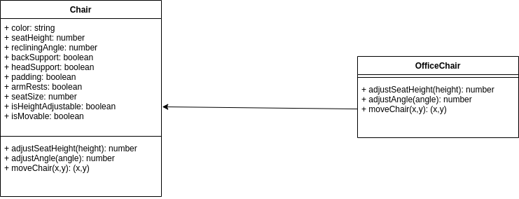

# JavaScript code
### Data types
let → You can reassign/change the value later.

const → Once assigned, you can’t reassign it.
```js
let name = "Suraj";
name = "Aditya";  // ✅ works

const city = "Hyderabad";
city = "Pune";    // ❌ Error: Assignment to constant variable

```
1. Scope

Both `let` and `const` are block-scoped (inside {}), unlike var which is function-scoped.

2. Hoisting

let and const are hoisted but in a “temporal dead zone” (not usable before declaration).
So you must declare them before using.
#### Number
```js
let n = 123;
n = 12.345;
```
Besides regular numbers, there are so-called “special numeric values” which also belong to this data type: Infinity, -Infinity and NaN.
Infinity represents the mathematical Infinity ∞. It is a special value that’s greater than any number.
```js
alert( 1 / 0 ); // Infinity
alert( Infinity ); // Infinity
alert( "not a number" / 2 ); // NaN, such division is erroneous
alert( NaN + 1 ); // NaN
alert( 3 * NaN ); // NaN
alert( "not a number" / 2 - 1 ); // NaN
```
So, if there’s a NaN somewhere in a mathematical expression, it propagates to the whole result (there’s only one exception to that: NaN ** 0 is 1).
#### The `null` value
The special null value does not belong to any of the types described above.
It forms a separate type of its own which contains only the null
```js
let age = null;
```
It’s just a special value which represents `nothing`, `empty` or `value unknown`.

#### The `undefined` value
The special value undefined also stands apart. It makes a type of its own, just like null.
The meaning of undefined is “value is not assigned”.
```js
let age;
alert(age); // shows "undefined"
let age = 100;
// change the value to undefined
age = undefined;
alert(age); // "undefined"
```
#### Boolean Conversion
```js
alert( Boolean(1) ); // true
alert( Boolean(0) ); // false
alert( Boolean("hello") ); // true
alert( Boolean("") ); // false
alert( Boolean("0") ); // true
alert( Boolean(" ") ); // spaces, also true (any non-empty string is true)
```
#### Exponentiation **
```js
alert( 2 ** 2 ); // 2² = 4
alert( 2 ** 3 ); // 2³ = 8
alert( 2 ** 4 ); // 2⁴ = 16
alert( 4 ** (1/2) ); // 2 (power of 1/2 is the same as a square root)
alert( 8 ** (1/3) ); // 2 (power of 1/3 is the same as a cubic root)

```
#### String concatenation with binary +
Let’s meet the features of JavaScript operators that are beyond school arithmetics.
Usually, the plus operator + sums numbers.
But, if the binary + is applied to strings, it merges (concatenates) them:
```js
let s = "my" + "string";
alert(s); // mystring
alert( '1' + 2 ); // "12"
alert( 2 + '1' ); // "21"
alert(2 + 2 + '1' ); // "41" and not "221"
alert('1' + 2 + 2); // "122" and not "14"
alert( 6 - '2' ); // 4, converts '2' to a number
alert( '6' / '2' ); // 3, converts both operands to numbers
```
#### Numeric conversion, unary +
```js
// No effect on numbers
let x = 1;
alert( +x ); // 1
let y = -2;
alert( +y ); // -2
// Converts non-numbers
alert( +true ); // 1
alert( +"" );   // 0
```
```js
let n = 2;
n += 5; // now n = 7 (same as n = n + 5)
n *= 2; // now n = 14 (same as n = n * 2)
alert( n ); // 14
```
Short “modify-and-assign” operators exist for all arithmetical and bitwise operators: /=, -=, etc.
```js
let n = 2;
n *= 3 + 5; // right part evaluated first, same as n *= 8
alert( n ); // 16
```
#### Increment/decrement
ncreasing or decreasing a number by one is among the most common numerical operations.
So, there are special operators for it:
Increment ++ increases a variable by 1:
```js
let counter = 2;
counter++;        // works the same as counter = counter + 1, but is shorter
alert( counter ); // 3
```
```js
let counter = 2;
counter--;        // works the same as counter = counter - 1, but is shorter
alert( counter ); // 1
```
### Logical operators
There are four logical operators in JavaScript: || (OR), && (AND), ! (NOT), ?? (Nullish Coalescing). Here we cover the first three, the ?? operator is in the next article.

Although they are called “logical”, they can be applied to values of any type, not only boolean. Their result can also be of any type.
##### || (OR)
```js
result = a || b;
alert( true || true );   // true
alert( false || true );  // true
alert( true || false );  // true
alert( false || false ); // false

if (1 || 0) { // works just like if( true || false )
  alert( 'truthy!' );
}
let hour = 9;

if (hour < 10 || hour > 18) {
  alert( 'The office is closed.' );
}
let hour = 12;
let isWeekend = true;

if (hour < 10 || hour > 18 || isWeekend) {
  alert( 'The office is closed.' ); // it is the weekend
}
```
##### && (AND)
```js
result = a && b;

alert( true && true );   // true
alert( false && true );  // false
alert( true && false );  // false
alert( false && false ); // false
```
### Loops: while and for
#### The `while` loop
```js
while (condition) {
  // code
  // so-called "loop body"
}

let i = 0;
while (i < 3) { // shows 0, then 1, then 2
  alert( i );
  i++;
}

```
Curly braces are not required for a single-line body
If the loop body has a single statement, we can omit the curly braces {…}:
```js
let i = 3;
while (i) alert(i--);
```
#### The `for` loop
The for loop is more complex, but it’s also the most commonly used loop.
```js
for (begin; condition; step) {
  // ... loop body ...
};
for (let i = 0; i < 3; i++) { // shows 0, then 1, then 2
  alert(i);
};
```
### The `switch` statement
```js
switch(x) {
  case 'value1':  // if (x === 'value1')
    ...
    [break]

  case 'value2':  // if (x === 'value2')
    ...
    [break]

  default:
    ...
    [break]
};

let a = 2 + 2;

switch (a) {
  case 3:
    alert( 'Too small' );
    break;
  case 4:
    alert( 'Exactly!' );
    break;
  case 5:
    alert( 'Too big' );
    break;
  default:
    alert( "I don't know such values" );
}
```
### Functions
```js
function showMessage() {
  alert( 'Hello everyone!' );
};
function showMessage() {
  alert( 'Hello everyone!' );
}

showMessage();
showMessage();

function showMessage(from, text = "no text given") {
  alert( from + ": " + text );
}

showMessage("Ann"); // 
```
#### Returning a value
```js
function sum(a, b) {
  return a + b;
}
let result = sum(1, 2);
alert( result ); // 3
``` 
#### Function expressions
```js
let sayHi = function() {
  alert( "Hello" );
};
let sayHi = function() { // (1) create
  alert( "Hello" );
};
```
#### Why is there a semicolon at the end?
You might wonder, why do Function Expressions have a semicolon ; at the end, but Function Declarations do not:
```js
function sayHi() {
  // ...
}
let sayHi = function() {
  // ...
};
```
The answer is simple: a Function Expression is created here as `function(…) {…}` inside the assignment statement: `let sayHi = …;`. The semicolon ; is recommended at the end of the statement, it’s not a part of the function syntax.

The semicolon would be there for a simpler assignment, such as `let sayHi = 5;`, and it’s also there for a function assignment.

### A Function Expression is created when the execution reaches it and is usable only from that moment.

#### Arrow functions, the basics
```js
let sum = (a, b) => a + b;
/* This arrow function is a shorter form of:
let sum = function(a, b) {
  return a + b;
};
*/
alert( sum(1, 2) ); // 3

let double = n => n * 2;
// roughly the same as: let double = function(n) { return n * 2 }

alert( double(3) ); // 6

let sum = (a, b) => {  // the curly brace opens a multiline function
  let result = a + b;
  return result; // if we use curly braces, then we need an explicit "return"
};

alert( sum(1, 2) ); // 3
```
## Objects

As we know from the chapter Data types, there are eight data types in JavaScript. Seven of them are called “primitive”, because their values contain only a single thing (be it a string or a number or whatever).

> primitive are stored in Stack memory. Nonprimitive are stored in Heap Memory.we get Nonprimitive reference only not actual values.
```js
let user = new Object(); // "object constructor" syntax
let user = {};  // "object literal" syntax
```
✅ Difference between the two
Object Literal {}
Short, clean, and most commonly used.
Directly creates an empty object.
Example:
```js
let user = {};
user.name = "Suraj";
```
Object Constructor `new Object()`
Longer, less common.
Does the same thing as {} under the hood: creates an empty object.
Example:
```js
let user = new Object();
user.name = "Suraj";
```
👉 Both produce the same result: an empty object.
Both behave the same ✅ — so `new Object()` gives no extra power.
```js
let user = {
  name: "John",
  age: 30,
  user.likes birds = true
}
user["likes birds"]
```
```js
function makeUser(name, age) {
  return {
    name: name,
    age: age,
    // ...other properties
  };
}

let user = makeUser("John", 30);
alert(user.name); // John
```
#### Property existence test, `in` operator.
```js 
let user = { name: "John", age: 30 };
alert( "age" in user ); // true, user.age exists
alert( "blabla" in user ); // false, user.blabla doesn't exist

let user = {
  name: "John",
  age: 30,
  isAdmin: true
};
for (let key in user) {
  // keys
  alert( key );  // name, age, isAdmin
  // values for the keys
  alert( user[key] ); // John, 30, true
};
```
```js
let user = {
  name: "John",
  surname: "Smith"
};
user.age = 25; // add one more

// non-integer properties are listed in the creation order
for (let prop in user) {
  alert( prop ); // name, surname, age
}
```
### Object references and copying
One of the fundamental differences of objects versus primitives is that objects are stored and copied “by reference”, whereas primitive values: strings, numbers, booleans, etc – are always copied “as a whole value”.
>A variable assigned to an object stores not the object itself, but its “address in memory” – in other words “a reference” to it.
```js
let user = { name: 'John' };

let admin = user;

admin.name = 'Pete'; // changed by the "admin" reference
alert(user.name); // 'Pete', changes are seen from the "user" reference

let a = {};
let b = a; // copy the reference
alert( a == b ); // true, both variables reference the same object
alert( a === b ); // true
```
### Cloning and merging, Object.assign
We can create a new object and replicate the structure of the existing one, by iterating over its properties and copying them on the primitive level.
```js
let user = {
  name: "John",
  age: 30
};

let clone = {}; // the new empty object

// let's copy all user properties into it
for (let key in user) {
  clone[key] = user[key];
}

// now clone is a fully independent object with the same content
clone.name = "Pete"; // changed the data in it

alert( user.name ); // still John in the original object
```
### We can also use the method `Object.assign.`

```js
Object.assign(dest, ...sources)
```
- The first argument dest is a target object.
- Further arguments is a list of source objects.
```js
let user = {
  name: "John",
  age: 30
};
let clone = Object.assign({}, user);
alert(clone.name); // John
alert(clone.age); // 30
```
#### Nested cloning
Until now we assumed that all properties of user are primitive. But properties can be references to other objects.
```js
let user = {
  name: "John",
  sizes: {
    height: 182,
    width: 50
  }
};
alert( user.sizes.height ); // 182
```
#### structuredClone
```js
let user = {
  name: "John",
  sizes: {
    height: 182,
    width: 50
  }
};
let clone = structuredClone(user);
alert( user.sizes === clone.sizes ); // false, different objects
// user and clone are totally unrelated now
user.sizes.width = 60;    // change a property from one place
alert(clone.sizes.width); // 50, not related
```
The structuredClone method can clone most data types, such as objects, arrays, primitive values.

It also supports circular references, when an object property references the object itself (directly or via a chain or references).

### Garbage collection
Memory management in JavaScript is performed automatically and invisibly to us. We create primitives, objects, functions… All that takes memory.
#### Reachability

The main concept of memory management in JavaScript is reachability.

Simply put, “reachable” values are those that are accessible or usable somehow. They are guaranteed to be stored in memory.

There’s a base set of inherently reachable values, that cannot be deleted for obvious reasons.

For instance:

The currently executing function, its local variables and parameters.
Other functions on the current chain of nested calls, their local variables and parameters.
Global variables.
(there are some other, internal ones as well)
These values are called **roots**.
```js
// user has a reference to the object
let user = {
  name: "John"
};
// make nonreachable 
user = null;
// Two references
let user = {
  name: "John"
};
let admin = user;
user = null;
```
…Then the object is still reachable via admin global variable, so it must stay in memory. If we overwrite admin too, then it can be removed.

### Internal algorithms
The basic garbage collection algorithm is called “mark-and-sweep”.

The following “garbage collection” steps are regularly performed:

- The garbage collector takes roots and “marks” (remembers) them.
- Then it visits and “marks” all references from them.
- Then it visits marked objects and marks their references. All visited objects are remembered, so as not to visit the same object twice in the future.
- …And so on until every reachable (from the roots) references are visited.
- All objects except marked ones are removed.

### Object methods, `this`
```js
let user = {
  name: "John",
  age: 30
};
// Actions are represented in JavaScript by functions in properties.
user.sayHi = function() {
  alert("Hello!");
};
user.sayHi(); // Hello!
```
#### `this` in methods
**To access the object, a method can use the this keyword.**
```js
let user = {
  name: "John",
  age: 30,
  sayHi() {
    // "this" is the "current object"
    alert(this.name);
  }
};
user.sayHi(); // John
```
#### What are classes?
JavaScript still follows a `prototype-based inheritance model`. Classes in JavaScript are **syntactic sugar** over the prototype-based inheritance model which we use to implement OOP concepts.
```ts
function Pen(name, color, price) {
    this.name = name;
    this.color = color;
    this.price = price;
}
const pen1 = new Pen("Marker", "Blue", "$3");
console.log(pen1);
Pen.prototype.showPrice = function(){
    console.log(`Price of ${this.name} is ${this.price}`);
}

pen1.showPrice();
```
**Classes**
```ts
class Chair {
    constructor(color, seatHeight, recliningAngle, backSupport, headSupport, padding, armRests, seatSize, isHeightAdjustable, isMovable){
        this.color = color;
        this.seatHeight = seatHeight;
        this.recliningAngle = recliningAngle;
        this.backSupport = backSupport;
        this.headSupport = headSupport;
        this.padding = padding;
        this.armRests = armRests;
        this.seatSize = seatSize;
        this.isHeightAdjustable = isHeightAdjustable;
        this.isMovable = isMovable;
    }

    adjustableHeight() {};
    adjustAngle(){};
    moveChair(){};    
}

const newChair = new Chair("Blue","25 inch","20 deg",true,false,"3 inch",true,"16 inch",false,false);

console.dir("Chair Prototype", Chair);
console.log("Chair Object", newChair);
```
**The chair class has the following members:**

**Attributes**: These will define the attributes of the chair such as color, seat height, backSupport, and so on.
**Functions**: These define the behavior of the chair. For example, if the chair has isHeightAdjustable set to true then it can use the function `adjustableHeight`. You can see that all the functions are declared in the `Chair` class. These are the abstract functions. We will talk more about these functions later in this article.

```ts
class OfficeChair extends Chair{
    constructor(color, isHeightAdjustable, seatHeight, recliningAngle){
        super();
        this.type = "Office Chair";
        this.color = color;
        this.isHeightAdjustable = isHeightAdjustable;
        this.seatHeight = seatHeight;
        this.recliningAngle = recliningAngle;
        this.isMovable = true;
    }

    adjustableHeight(height){
        if(height > this.seatHeight){
            console.log(`Chair height changed to ${height}`);        
        } else {
            console.log(`Height cannot be decreased more than the seat height ${this.seatHeight}`);
        }
    }

    adjustAngle(angle){
        if(angle >= this.recliningAngle){
            console.log(`Chair angle changed to ${angle}`);        
        } else {
            console.log(`Angle cannot be decreased more than the min reclining angle ${this.recliningAngle}`);
        }
    }

    moveChair(x,y){
        console.log(`Chair moved to co-ordinates = (${x}, ${y})`);
    }
}

const newOfficeChair = new OfficeChair("Red", true, 30, 30);

console.log(newOfficeChair.adjustableHeight(31));
console.log(newOfficeChair.adjustAngle(40));
console.log(newOfficeChair.moveChair(10,20));
```
This is a class that inherits the functions and attributes from the superclass `chair`. It uses the `extends` keyword to allow the `OfficeChair` class to perform inheritance.

**The `extends` keyword has the following syntax:**
`class ChildClass extends ParentClass{...}`
- We use the `super` keyword to call the constructor of the parent class. We can also use it to call functions and properties of the parent class.

- Make sure you call the `super` function at the start of the constructor. If you don't, and you try to access the parent class's properties before you use `super` in the child class constructor, it will throw an error.
- Once the `super` function is called, then you can access all the attributes and functions of the parent class.
#### Static Keyword in Javascript
The `static` keyword in JavaScript helps you define functions and properties in the class that cannot be called by the instance of the object. They can only be called by the class itself which consists of these static functions and properties.
###### The advantage of using static functions or properties in a class is that:
- They can be used to create functions/properties which need not be present in the instances. This helps to maintain some isolation in the codebase.
- They reduce code redundancy in some cases.
  
 `static` in a JS/TS class means: the property or method belongs to the class itself, not to each object (instance). 
 **1) Without static (instance method)**
 ```ts
 class User {
  constructor(name) {
    this.name = name;
  }

  sayHi() {
    return `Hi ${this.name}`;
  }
}

const u = new User("Suraj");
u.sayHi();      // ✅ works
// User.sayHi(); // ❌ error (not on class)

 ```
 **2) With static (class method)**
 ```ts
class MathUtils {
  static add(a, b) {
    return a + b;
  }
}

MathUtils.add(2, 3); // ✅ 5
// new MathUtils().add(2,3) // ❌ error

 ```
 **Factory methods (create objects in a controlled way)**
 ```ts
class User {
  constructor(name, role) {
    this.name = name;
    this.role = role;
  }
  static admin(name) {
    return new User(name, "admin");
  }
}
const a = User.admin("Suraj"); // ✅ creates User

 ```